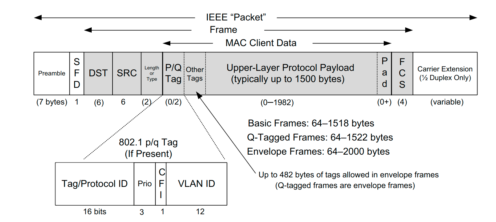
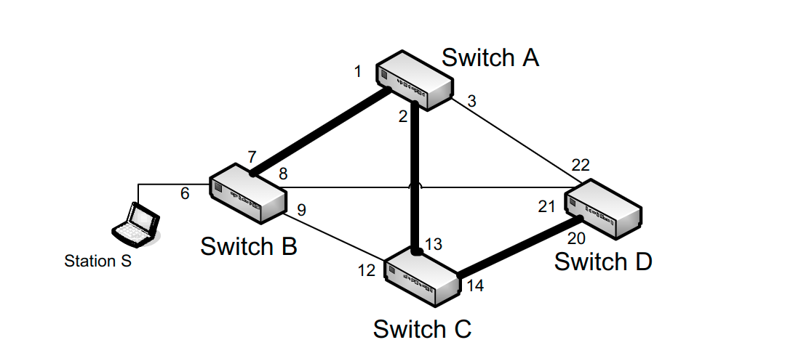

# TCP/IP Illustrated

## Link Layer

+ **CSMA/CD**: (carrier  sense,  multiple  access  with  collision  detection) 载波监听，碰撞检测协议。以太网（ Ethernet）用的一种协调同一总线上各站点发送数据帧（frame，链路层的PUD）的协议。

  > 但是CSMA/CD 一般用于 10Mb/s 的以太网， 到后来 100Mb/s 甚至更高带宽的以太网，用的是星型拓扑结构，每个主机之间用交换机（switch）连接起来，每条线路都是全双工通道（可以同时接收和发送信息），交换机可以隔离碰撞域，所以就不需要CSMA/CD协议了。
  >
  > 以前不用交换机的以太网就是半双工通信，要进行碰撞检测。

+ **Frame format**:

  

+  **FCS**: (Frame Check Sequence/Cyclic Redundancy Check (CRC)): 循环冗余码检测, 检测帧在传输过程中是否

  是否出现差错，但是不能定位差错

+ **Frame Sizes**: 数据链路层的帧长度有最大最小限制，一般而言（IEEE的某个协议规定）最小是 ``64 bytes``  ,不足的用``0 bits``填充. 最大长度是``1518 bytes`` 但是对于网络层的最大``64 KB`` 的数据报，帧长度显然不够，就需要对数据报进行分片，至少``44 frames`` , 为了提高数据传输率，有的协议会扩大帧长度，能超过``9000 bytes`` 

  > 最小帧长度是为了适应在使用CSMA/CD以太网中，发送时延满足一个往返时间。当发送最后一个bit时，能检测到有无碰撞。 
  >
  > 设置最大长度是为了在CRC检测到错误丢弃帧时，减少重发带来的损耗。

+ **VLAN**: 使用交换机的以太网可以方便的实现多播、广播，但是当以太网中的主机过多，多个主机同时进行广播就会严重占用信道资源，同时也出于一些安全考虑，就出现一种策略，将一个以太网通过``交换机端口(常用)``、``MAC地址``或``IP地址`` 来分为多个不同的虚拟局域网``VLAN`` , 进行逻辑上的切分，在链路上发送帧时，通过帧内的``VLAN ID`` 来区分。不同虚拟局域网之间的通信要通过路由器``router`` 来完成。

+ **LACP**:（Link Aggregation Control Protocol），有的操作系统有多个网络接口可以实现链路聚合，可以同时通过多个接口发送数据实现高速可靠的数据传输，从而降低了对高性能交换机的需求。

  > 书中举例将有限以太网接口和无线局域网接口聚合，生成一个虚拟接口，数据报通过虚拟接口转发，然后有五种模式来确定数据报实际是由哪个接口发送。比如两个接口可以实现负载均衡转发或者备份转发。
  
+  **Duplex Mismatch**: 双工不匹配问题。当通信的两个接口之间一个使用全双工通信，一个使用半双工通信时，通常不会报告错误。当线路上的流量增长到一定程度，半双工接口会检测到碰撞，从而触发CSMA/CD协议的指数退避机制，被丢失的数据报又会触发发送方的高层协议(TCP)的重发机制，严重降低性能。 而这种错误只有在半双工接口在发送数据，但是又在持续接收数据时才能检测到。

+ **Link-Layer FLow Control**: 链路层也有流量控制。交换机可以储存转发数据帧，当多个站点同时向一个站点发送数据时，交换机会缓存一些数据帧，如果长时间没有被处理，该数据帧就会被丢弃。所以协议规定，交换机可以发送``PAUSE frames`` 到所有站点告知他们停止一段时间（512 bit times）再发送数据. 但是这也引发一些问题，交换机会对那些无辜的站点也发送停止信息。因此链路层的流量控制不是很常用。

+ **Bridges And Switches**: 交换机就是高性能网桥，接口多。 交换机的转发表``filtering databases`` 是通过学习得来的。开机时转发表是空的，然后每次转发都会记录数据帧源MAC地址，如果没有目的地址，就转发到所有端口，所以一开始交换机学习的过程中网络链路是高负载的。一些操作系统也实现了交换机的学习功能，所以基于windows和linux的电脑也可以充当交换机。因为有的设备的MAC地址会变，所以转发表的每条记录都有一个有效期，有效期一过就要删除该记录，重新学习。

+ **STP**: (Spanning Tree Protocol) 生成树协议（由每个交换机实现）

  > 下面这种拓扑结构在交换机学习的过程中会产生广播风暴，所以使用生成树协议打破闭环，生成唯一一条路径，任何站点可以通过该路径达到任何一个站点。生成树路径可以有很多条，但是通过各链路的带宽选择性能最高的一条。下面黑线加粗的部分就是一条生成树路径，路径上的端口可以转发分组，其他端口都被阻塞。

  